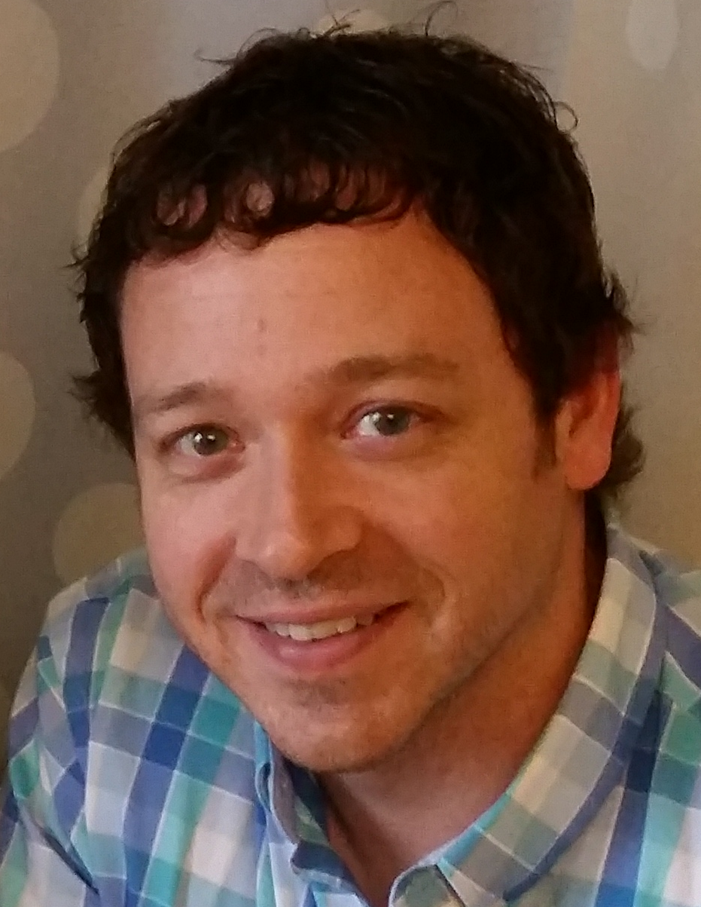
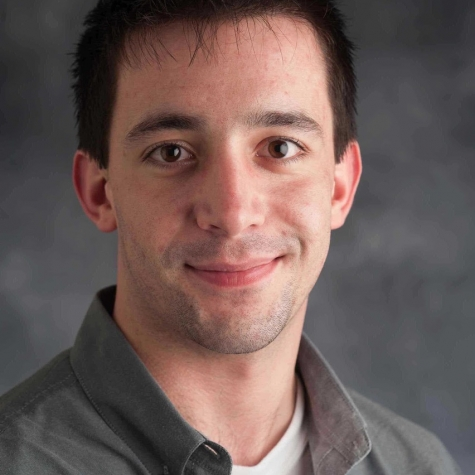
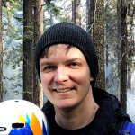

Organizers
++++++++++

Workshop Chairs
===============

Pete Mendygral (Hewlett Packard Enterprise)
-------------------------------------------

Pete Mendygral is a Distinguished Technologist in the HPC&AI Cloud Services organization at HPE where he works on
HPC in the cloud and technologies focused on productivity and efficiency for complex workloads and workflows.
Pete received a PhD in astrophysics from the University of Minnesota in 2011, where he developed HPC applications to
study outflows from supermassive blackholes.

|

|

Sam Foreman (Argonne National Labs)
-----------------------------------

Sam Foreman is a computational scientist with a background in high energy physics at the ALCF.
He is generally interested in the application of machine learning to computational problems in physics, particularly
within the context of high performance computing. Sam's current research focuses on using deep generative modeling to
help build better sampling algorithms for simulations in lattice gauge theory.

|

|

Daniel Margala (National Energy Research Scientific Computing Center)
---------------------------------------------------------------------

Daniel Margala is a Scientific Data Architect in the Programming Environments and Models group at NERSC. Previously,
he was a NERSC Exascale Science Application Program (NESAP) postdoctoral fellow at Lawrence Berkeley National Laboratory
working with the Dark Energy Spectroscopic Instrument (DESI) data processing team, focusing on high performance
computing with GPUs using Python. Daniel has a PhD in Physics from the University of California, Irvine and a BS in
Physics from the University of California, Los Angeles.

|

|

Technical Program Committee
===========================

* Venkat Vishwanath (Argonne National Labs)
* Christine Simpson (Argonne National Labs)
* Torsten Hoefler (ETH Zurich)
* Laurie Stephey (National Energy Research Scientific Computing Center)
* Brandon Cook (National Energy Research Scientific Computing Center)
* Rollin Thomas (National Energy Research Scientific Computing Center)
* Bjoern Enders (National Energy Research Scientific Computing Center)
* Eric Eilertson (Microsoft)
* Sreenivas Rangan Sukumar (Hewlett Packard Enterprise)
* Davin Potts (Appliomics)
* Benjamin Keen (Microsoft)