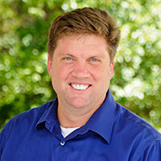
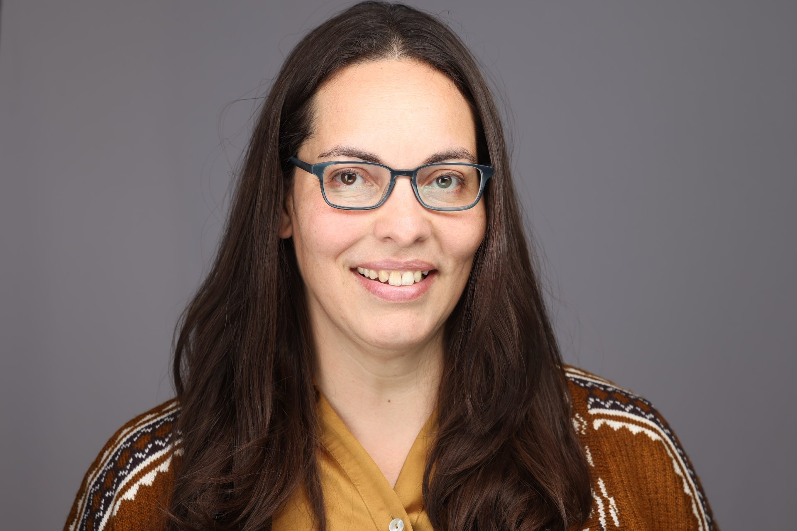
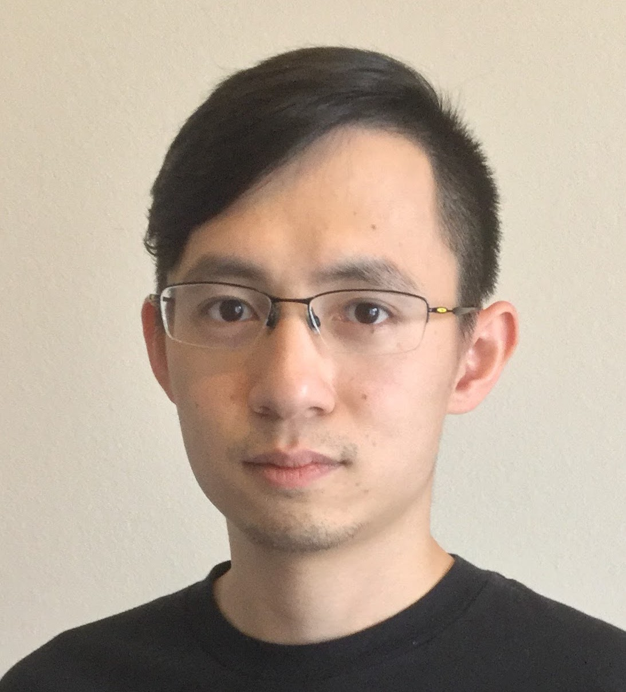
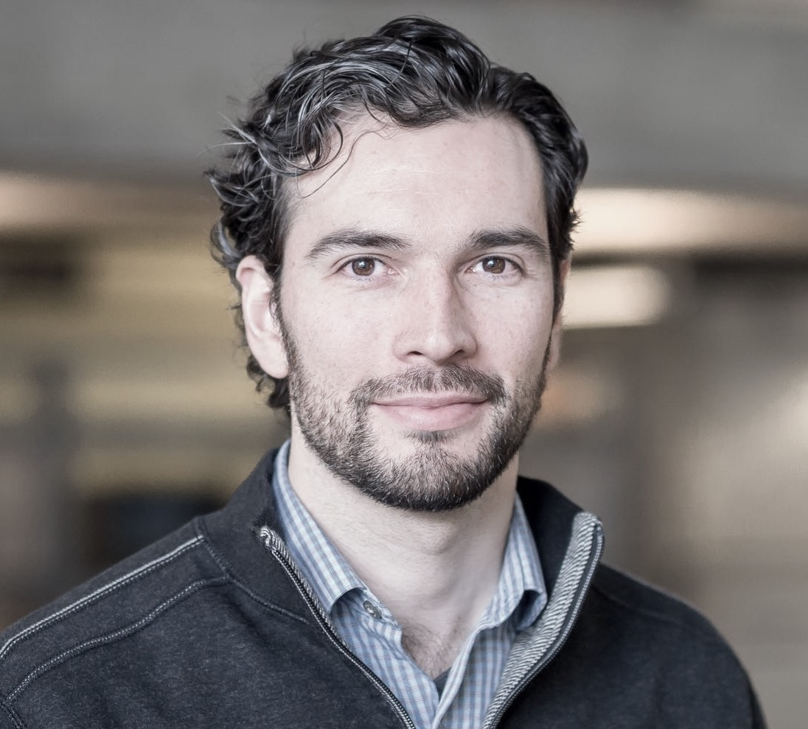

Workshop Schedule
+++++++++++++++++

HPPSS will take place on Sunday, November 12th from 9 AM - 12:30 PM. Please stay tuned for updates on the agenda for
the day. We are very pleased to announce the invited speaker for the workshop is Travis Oliphant.

.. _Travis:

Travis Oliphant (Quansight) - Invited Speaker
=============================================

Dr. Oliphant has a Ph.D. in Biomedical Engineering from the Mayo Clinic, and M.S. and B.S. degrees in Electrical
Engineering (and Math) from Brigham Young University. Travis has worked extensively with Python for numerical and
scientific programming since 1997, and was the primary developer of the NumPy package and the author of the definitive
Guide to NumPy. He is also the primary founding author of the SciPy package and creator of the Numba project.  He has
also been an organizing influence in the creation of Conda, Dask, JupyterLab, and Nebari.  During his academic career,
he has worked in the fields of satellite remote sensing, Magnetic Resonance Imaging (MRI), ultrasound, elastography,
and general inverse problems as an Assistant Professor of Electrical and Computer Engineering at Brigham Young
University from 2001 to 2007. He has done consulting work since 1997 in many areas involving science, industry, and
computation including laser scattering off of semiconductors, sparse matrix calculations for search engines, mesh
transformations for fluid dynamics, real-time risk calculations, real-time trading algorithms, open-source development,
and many other projects. Dr. Oliphant was a leader at Enthought from 2007 until 2011 and then founded Anaconda in 2012,
serving as its founding CEO until 2017. Travis founded Quansight in 2018, Quansight Initiate in 2019, and OpenTeams in
2020. He is passionate about connecting open-source communities with companies and investors and finding aligned
incentives for the world to thrive with innovation.

Speaker Email
travis@quansight.com

Panel Discussion
================

Fernanda Foertter (Voltron Data)
--------------------------------

Fernanda holds a Master's in Materials Science Engineering from the University of Florida and a Bachelor's in Physics
from Florida International University. She's passionate about supercomputers and finding ways to improve efficiency,
utilization and user friendly interfaces in the scientific and data science communities.

She is currently a Director at a startup, Voltron Data Inc, and leads both developer relations and leads R&D partnership
efforts to develop better tools for data analytics. Previously, she spent 6 years as HPC User Assistance Group as an
HPC Programmer and Training Coordinator at the Oak Ridge Leadership Computing Facility. She participated in the CORAL
project that selected Summit as the next supercomputer to replace Titan. She was also part of the Exascale Computing
Project and was co_PI on two ECP projects: Kokkos and Training. For her last two years, she was an HPC Data Scientist
working on the CANDLE project (aka Biden's Cancer Moonshot). Throughout her time at ORNL she also served on the C++,
OpenMP, and OpenACC language committees where she was the release manager for the latter.

Torsten Hoefler (ETH Zurich)
----------------------------

.. figure:: images/hoefler_dinfk.jpg
   :align: left
   :scale: 10 %

Torsten Hoefler is a Professor of Computer Science at ETH Zurich, a member of Academia Europaea, and a Fellow of the
ACM and IEEE. His research interests revolve around the central topic of "Performance-centric System Design" and include
scalable networks, parallel programming techniques, and performance modeling. Torsten won best paper awards at the
ACM/IEEE Supercomputing Conference SC10, SC13, SC14, SC19, SC22, EuroMPI'13, HPDC'15, HPDC'16, IPDPS'15, and other
conferences. He published numerous peer-reviewed scientific conference and journal articles and authored chapters of
the MPI-2.2 and MPI-3.0 standards. He received the IEEE CS Sidney Fernbach Award, the ACM Gordon Bell Prize, the ISC
Jack Dongarra award, the Latsis prize of ETH Zurich, as well as both ERC starting and consolidator grants. Additional
information about Torsten can be found on his homepage at htor.inf.ethz.ch.

Siu Kwan (Anaconda)
-------------------

Siu Kwan Lam is the lead developer of the Numba open-source compiler project at Anaconda. He received an MS degree in
computer engineering from San Jose State University. During his academic journey, he had the privilege of assisting in
the development and instruction of the CUDA programming course. In collaboration with the GPU Open Analytics Initiative,
Siu Kwan played a part in the early stages of the GPU DataFrame project, which eventually evolved into the RAPIDS
framework. He remains passionate about exploring ways to integrate compiler technologies into the Python ecosystem.

|

Travis Oliphant (Quansight)
---------------------------

Travis is our invited speaker, and you can learn more about him :ref:`here<Travis>`.

Ben Zaitlan (NVIDIA)
--------------------

Richard Zamora (NVIDIA)
-----------------------

Richard (Rick) Zamora is a Senior Systems Software Engineer on the RAPIDS team at NVIDIA. After earning his PhD at
Cornell University, he began his career in the Theoretical Division at Los Alamos National Laboratory, and eventually
moved into parallel-computing research and high-performance software engineering. Richard is currently working to
improve the performance and scalability of distributed RAPIDS libraries (especially Dask cuDF) and is a frequent
contributor to several open-source Python projects.

